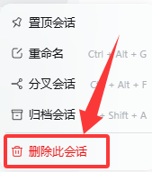
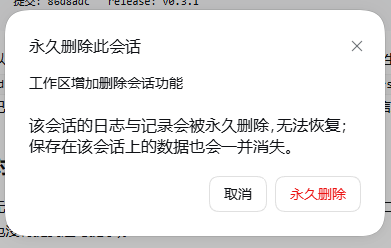

# dsh-session-delete

[English](README.en.md) · 中文

DeepSeek Harness(DSH)插件:在侧栏会话行的「…」菜单里**永久删除**会话,并在用户消息与
AI 回复的**复制按钮右侧**加「重试」。

```
侧栏会话行「…」                用户消息 / AI 回复
  ├ 置顶                        [时间] [复制] [重试] [反馈] [分叉]
  ├ 重命名                            └── 本插件(复制按钮右侧)
  ├ 分叉
  ├ 归档
  └ 删除此会话  ← 本插件
```

- **删除是真正的删除**:会话日志目录、工作区归属、宿主内存实例、客户端列表行,
  四处一起清,不留幽灵行、不进「未分组」、不需要重启。
- **重试是把这条输入重新提交一次**:AI 回复重试 = 重发它之前那条用户输入;用户消息重试
  = 重发这条输入本身。DSH 的事件日志是 append-only,所以旧回复会留在上方,新回复追加在
  下方(这不是替换式重生成,详见[重试语义](#重试语义))。

## 界面

| 会话行「…」菜单 | 永久删除确认 |
|---|---|
|  |  |

截图同时通过 [`screenshots.json`](screenshots.json) 提供给插件市场详情页;换图只要替换
`assets/` 里的文件(想调顺序或增删就改 `screenshots.json`,最多 8 张)。

## 环境要求

| 项 | 要求 |
|----|------|
| DSH | 0.2.x(Web UI / Desktop 均可;插件只依赖公开的 Host 服务与 Client 插槽) |
| Node | ≥ 22(仅开发/测试需要) |
| 依赖 | 无。不声明任何 `@deepseek-ai/dsh-*` peerDependencies |

## 安装

### 方式 A:插件管理器(推荐)

把本目录放到工作区(克隆仓库或解压产物包),让 DSH 执行一次
`plugin_manager` → `install_bundle`,target 为本目录的**绝对路径**:

```
install_bundle  target: <本目录绝对路径>
```

它会把包装进当前 profile、把本插件自带的 [`cordis.patch.yml`](cordis.patch.yml)
(`- insert: id: session-delete`)注进 profile 根,并把 `dsh-session-delete` 加进
`dsh.profile.bundles`。启用 HMR 的 profile **当场生效**;否则重启一次 DSH。

### 方式 B:从产物包安装(.tgz)

```sh
npm pack                     # 产出 dsh-session-delete-<版本>.tgz
```

把 `.tgz` 发给对方,解压后用方式 A 安装,或由 DSH 的插件页选择该文件。

### 方式 C:开发用 junction(改代码即生效)

```powershell
$profile = "$env:USERPROFILE\.dsh\profiles\desktop"
New-Item -ItemType Junction -Path "$profile\node_modules\dsh-session-delete" -Target "<本目录绝对路径>"
# profile 的 package.json:dependencies 追加 "dsh-session-delete": "file:<本目录绝对路径>"
#                       dsh.profile.bundles 追加 "dsh-session-delete"
# 重启 DSH
```

host 半区的改动要重启 DSH 生效;client 半区(浏览器产物)改动要重启 + 刷新页面。

### 卸载

插件页停用/移除该组合包,重启即可;手动安装的删掉 junction、依赖行与 bundles 条目。
本插件不写任何持久状态(只读会话日志、删除时直接动产物目录),卸载后不留残余。

## 使用

### 删除会话

会话行右侧「…」→「删除此会话」→ 确认弹窗(红色确认按钮,文案说明不可恢复)。

- 只有**非运行中**的会话可删;运行中的菜单项置灰并标注原因,服务端也会二次拒绝。
- 产物已不存在的会话**不再拒绝**:走「清理列表」(`mode: ghost`),把残留行彻底清掉。
- 失败/半成功都有顶部轻提示说明(约 3.2s 消失)。

### 重试

| 位置 | 按钮 | 行为 |
|------|------|------|
| AI 回复 | 复制按钮右侧的刷新图标 | 取该回复**之前最近一条**用户输入,重新提问 |
| 用户消息 | 复制按钮右侧的刷新图标 | 重新提交这条输入本身 |

只重发**文本**:图片/文件附件不重发。点击后按钮短暂禁用,成功后轻提示
「已重新提交这条输入,模型将重新回答」。

## 删除到底删了什么

`POST /api/session-delete/delete { sessionId, confirm: true }` 依次做四件事
(任何一步失败都不静默吞掉,响应里逐项汇报):

1. **删产物**:由 `sessionPersistence.locate(header)` 定位日志文件,回收其**父目录**
   (避免残留空壳目录)。Windows 上日志可能仍被写句柄占用而失败 → 先摘运行时实例、
   等 300 ms 再重试;仍失败才降级回收区(`quarantine`),全失败才拒绝并提示「产物被占用」。
2. **摘宿主内存实例**:按官方自身的 detach 路径(`SessionStore` / `AgentRegistry` 的
   公开 `store` Map + `detachEntered(entry)`),先 agent 后 session。官方由此发
   `session/disposed`,不再以 live 优先返回该会话。
3. **解绑工作区**:逐个工作区 `detachSession(sessionId)`(账本 `sessionIds` 命中优先,
   cwd 回退匹配并短暂重试),失败不中断,响应附 `detached: false` 与提示。
4. **清归档集合残留**:避免归档面板以空壳行复活。

最后**补发官方 `api-session/removed` 事件**——这是冷会话(没加载进内存、第 2 步没有实例
可摘)唯一能让客户端列表行立即消失的通知。响应里的 `announced` 字段即这一步的结果。

### 为什么必须补发那条事件

官方契约(见 `docs/internals.md`)是:

```js
// Host:api-session-controller
ctx.on('session/disposed', (session) => { ctx.emit('api-session/removed', session.id); });
// Client:api-session-controller
ctx.remote.$on('api-session/removed', (sessionId) => sessions.handleSessionRemoved(sessionId));
```

`detachEntered` 会触发前者,但**只对内存里活着的会话有效**。冷会话删掉产物后没有任何
通知,客户端就会保留一行空壳:点开报 `历史加载失败:session "…" not found(session/not-found)`。
v0.3.0 起删除路径无论冷热都补发该事件。

### 失效行清理(sweep)

升级前遗留的空壳行、或手动删过日志目录的会话,可以用:

```
POST /api/session-delete/sweep        # 无需请求体
→ { ok, scanned, cleaned: [{ sessionId, announced, disposed, detached }], kept: [...] }
```

它扫描「工作区账本(含归档集合)+ 宿主内存 store」里的全部会话 id,
**只清理持久化里已经不存在的**(判定唯一依据:产物目录不存在),任何日志还在的会话
一律进 `kept`,绝不误删。

## 路由

| 方法 | 路径 | 说明 |
|------|------|------|
| GET | `/api/session-delete/status?sessionId=<id>` | 删除资格:`{ running, artifactExists, deletable, reason }` |
| POST | `/api/session-delete/delete` | 请求体 `{ sessionId, confirm: true }`;成功 `{ ok, mode, detached, disposed, announced }` |
| POST | `/api/session-delete/sweep` | 清理失效行(只清无产物的) |
| GET | `/api/session-delete/retry-source?sessionId=<id>&messageId=<id>` | 只读:解析该消息要重发的文本 `{ role, text, userMessageId, mode: 'queue' }` |

`mode` 取值:`purge`(默认,直接永久删除)、`recycle`(系统回收站)、
`quarantine`(回收站不可用时的插件回收区降级)、`ghost`(产物已不存在,仅清理列表)。

**重试没有 host 路由**:`sessionController.prompt` 是 `@Remote` 方法(定义里
`cancellation: { parameter: 'signal' }`),插件直接调用会抛
`Cannot read properties of undefined (reading 'throwIfAborted')`。正确姿势是客户端会话绑定,
与输入框发送完全同一条路:

```js
sessions.using(id, { source: 'workspaceOperation' },
  (ref) => ref.binding.session.prompt([{ type: 'text', text }], 'queue'));
```

host 只提供只读的 `retry-source` 解析文本;`retry-source` 返回的 `mode` 字段用于告知客户端
按 `queue` 投递。

## 配置(可选)

| 字段 | 默认 | 说明 |
|------|------|------|
| `trashMode` | `purge` | `purge` = 直接永久删除;`recycle` = 优先系统回收站,失败降级插件回收区 |
| `quarantineDir` | `~/.dsh/trash/session-delete` | 回收区降级时的暂存目录 |

```yaml
- insert:
    - id: session-delete
      name: dsh-session-delete
      config:
        trashMode: purge          # 或 recycle
        quarantineDir: D:\dsh-trash
```

删掉或注释掉 `config` 即用默认值。本插件没有 `Config` 导出,配置不会被校验:
多写的字段被忽略,写错类型的字段退回默认值。

## 文案与本地化

- 界面文案走 Client `locale` 服务:插件在 `apply` 里用 `locale.register(NS, 'zh'|'en', dict)`
  注册字典,再用 `locale.bind(NS)` 取翻译函数(调用时读当前语言)。语言切换后已渲染的
  菜单项、弹窗、已注入的按钮 `title`/`aria-label` 都会跟着更新。
- locale 服务缺席、注册冲突或字典缺失时**一律回退中文**,本地化层不会成为功能故障点。
- 清单元数据(`meta.title` / `meta.description` / 图标)在 [`locale/zh.json`](locale/zh.json)、
  [`locale/en.json`](locale/en.json)、[`icon.svg`](icon.svg),插件管理器读它们不需要激活插件。
- 服务端(host)返回的错误文案目前固定中文,属于已知取舍。

## 已知取舍

- **永久删除不可恢复**:默认 `trashMode: purge` 直接删会话产物目录,不进回收站。
  需要可还原时设 `trashMode: recycle`(还原后可用已装的
  `@mzzsfy/dsh-session-manager` 面板「重新挂载」找回)。
- **为什么"删了还挂在未分组"**:官方 `session.list` 以 **live 优先**——只要宿主内存里还有
  该会话的 `Session`/`Agent` 实例(侧栏激活过的会话都是),列表仍会返回它;而工作区账本已被
  摘掉,于是它落进「未分组」桶。所以删除必须连内存实例一起摘(见上文第 2 步)。
  这些字段属于宿主内部结构:缺失时静默降级,绝不抛错。
- **运行中的会话**由 host 权威拒绝;client 置灰只是提示(客户端的运行态可能略滞后)。
- **不做**:批量删除、回收站还原台账、「下次不再提示」记忆(每次删除都要确认)。
- **与 `@mzzsfy/dsh-session-manager` 的分工**:对方只允许删除**已归档**会话,自带回收站
  台账与重挂载;本插件面向「任意非运行中会话的一次性清理」。两者入口互不影响,
  但指向同一份产物:先执行的那个生效。

## 开发

```sh
node --test test/smoke.mjs      # 25 项测试
```

覆盖:运行中判定、status/delete/sweep 路由(方法闸、确认标记、未知会话、运行中拒绝、
purge 真删产物、摘内存实例、幽灵行清理、产物被占用后摘实例再重试、解绑失败半成功、
recycle/回收区降级与双失败拒绝、同 id 并发)、官方通知事件(`api-session/removed`)、
sweep 只清无产物行、client 半区加载面与三个注册项、locale 注册与回退。
测试用真实临时目录 + 注入的执行器与同形 store 桩,**不触碰真实会话**。

代码结构与官方契约依据见 [`docs/internals.md`](docs/internals.md)。

### 发布检查清单

1. 改 `package.json` 的 `version`,在 [`CHANGELOG.md`](CHANGELOG.md) 加一节;
2. `node --test test/smoke.mjs` 全绿;
3. `npm pack` 校验产物只含 `files` 列出的内容;
4. 在 DSH 里重装/重启一次,确认菜单项与两个按钮仍在(见 docs/internals.md 的自检清单)。

## 分发须知

- **不声明任何 `@deepseek-ai/dsh-*` peerDependencies**:插件的兼容判定只看这些 peer,
  没有 peer 就意味着任何 DSH 版本都能装,不会被版本豁免机制拦下。
- **启动安全(重要)**:host 半区导出空 `inject`,`webServer` / `sessionQuery` /
  `workspaceRegistry` / `agents` 全部在 `apply` 内用 `ctx.inject` **软注入**。
  任一宿主服务缺失或改名,本插件只是不注册路由(菜单项显示「无法读取会话状态」),
  **绝不会因服务未满足而变成 pending 把 `web boot` 拖垮**——那正是硬注入插件的翻车方式。
- **client 半区依赖面**:只 `require("react")` 与
  `@deepseek-ai/dsh-client-ui-primitives`(loader 的隐式 baseline external),
  不额外依赖其它插件模块;共享状态用自带的极简快照 store,不引入 `dsh-client-store`。
- 想上架 npm 集市:去掉 `"private": true` 后 `npm publish --access public`,
  别人即可直接安装;或推 GitHub 后用
  `install_bundle` 指向仓库目录 / `dsh plugin add github:<user>/<repo>#<commit>`。

## 许可

[MIT](LICENSE)
